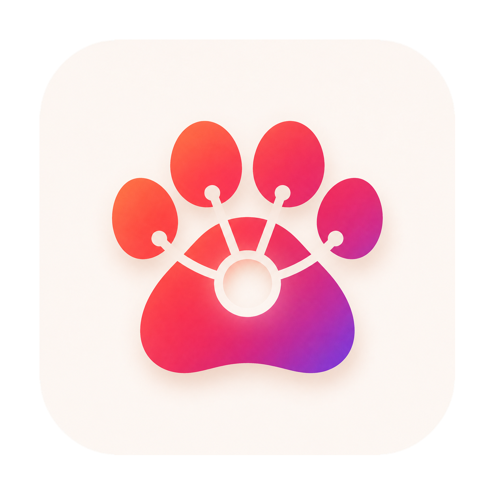

<div align="center">
  <a href="https://discoverivan.github.io/mework/">
    
  </a>
  <h1>mework</h1>
  <p><strong>A local-first desktop workspace for Jira, pull requests, and AI-assisted delivery.</strong></p>
  <p>
    <a href="https://discoverivan.github.io/mework/"><strong>Download latest</strong></a>
    &nbsp;·&nbsp;
    <a href="https://github.com/Discoverivan/mework/releases/latest">Release notes</a>
    &nbsp;·&nbsp;
    <a href="https://github.com/Discoverivan/mework/actions">Build status</a>
  </p>
  <p>
    <a href="https://github.com/Discoverivan/mework/releases/download/mework-v0.1.8/mework_0.1.8_aarch64.dmg">macOS · Apple Silicon</a>
    &nbsp;·&nbsp;
    <a href="https://github.com/Discoverivan/mework/releases/download/mework-v0.1.8/mework_0.1.8_x64.dmg">macOS · Intel</a>
    &nbsp;·&nbsp;
    <a href="https://github.com/Discoverivan/mework/releases/download/mework-v0.1.8/mework_0.1.8_x64-setup.exe">Windows</a>
  </p>
  <p>
    
    <a href="https://github.com/Discoverivan/mework/actions/workflows/ci.yml?query=branch%3Amaster"></a>
    <a href="https://github.com/Discoverivan/mework/actions/workflows/release.yml?query=branch%3Amaster"></a>
  </p>
</div>

## Latest release: `v0.1.8`

The current release is available for macOS and Windows. The [download page](https://discoverivan.github.io/mework/) resolves the latest GitHub release automatically; the links below point to the exact `v0.1.8` artifacts.

| Platform | Installer | Updater bundle |
| --- | --- | --- |
| macOS · Apple Silicon | [DMG](https://github.com/Discoverivan/mework/releases/download/mework-v0.1.8/mework_0.1.8_aarch64.dmg) | [`.app.tar.gz`](https://github.com/Discoverivan/mework/releases/download/mework-v0.1.8/mework_0.1.8_aarch64.app.tar.gz) · [signature](https://github.com/Discoverivan/mework/releases/download/mework-v0.1.8/mework_0.1.8_aarch64.app.tar.gz.sig) |
| macOS · Intel | [DMG](https://github.com/Discoverivan/mework/releases/download/mework-v0.1.8/mework_0.1.8_x64.dmg) | [`.app.tar.gz`](https://github.com/Discoverivan/mework/releases/download/mework-v0.1.8/mework_0.1.8_x64.app.tar.gz) · [signature](https://github.com/Discoverivan/mework/releases/download/mework-v0.1.8/mework_0.1.8_x64.app.tar.gz.sig) |
| Windows · NSIS | [`.exe`](https://github.com/Discoverivan/mework/releases/download/mework-v0.1.8/mework_0.1.8_x64-setup.exe) | [signature](https://github.com/Discoverivan/mework/releases/download/mework-v0.1.8/mework_0.1.8_x64-setup.exe.sig) |
| Windows · MSI | [`.msi`](https://github.com/Discoverivan/mework/releases/download/mework-v0.1.8/mework_0.1.8_x64_en-US.msi) | [signature](https://github.com/Discoverivan/mework/releases/download/mework-v0.1.8/mework_0.1.8_x64_en-US.msi.sig) |

See the complete [v0.1.8 release](https://github.com/Discoverivan/mework/releases/tag/mework-v0.1.8) for checksums, updater metadata, and all published assets.

> **macOS note:** the application is ad-hoc signed and not notarized. On first launch, macOS may require **System Settings → Privacy & Security → Open Anyway**.

## What it does

mework keeps day-to-day engineering work in one local desktop workspace:

- **Create task** — describe work in natural language, generate an editable AI draft, choose `Task` or `Spike`, review Jira fields, and create the issue only after an explicit action.
- **Daily** — inspect active-sprint subtasks by team member, refresh status, and open a second-window presenter view for stand-ups.
- **Pull Request Review** — poll Bitbucket pull requests, track new or updated activity, run an AI review, inspect severity-grouped comments, and publish an edited comment or decision from the review flow.
- **My Pull Requests** — follow authored pull requests, surface items that need attention, and optionally run automatic AI review for configured activity.
- **Command Board** — keep local scripts and commands close at hand and run them from a small, editable command board.
- **Settings** — manage Jira and Bitbucket connections, AI providers, managed teams, notifications, themes, and application updates.

## How it works

- **Tauri 2 shell** with a React, TypeScript, and Vite renderer.
- **Rust local core** owns polling, SQLite state, provider requests, AI adapters, credentials, notifications, workflows, and recovery.
- **Jira and Bitbucket** are read through polling; the background refresh interval is five minutes. Webhooks are intentionally out of scope.
- **Remote writes require an explicit user action** and are handled by the Rust core rather than the renderer or an AI agent.
- **AI providers:** local Codex CLI or an OpenAI-compatible API. OpenAI-compatible models are discovered from `GET <base URL>/models`; static model metadata is not used.
- **Themes:** white/light and dark, with the initial choice following the operating-system preference.

## Privacy and credentials

- Jira, Bitbucket, and OpenAI-compatible API credentials are stored only in the native operating-system keyring.
- SQLite stores local application state and credential references, not token values.
- Credentials, authorization headers, and full prompts are not returned to the renderer or written to logs.
- OpenAI-compatible external URLs must use HTTPS; HTTP is reserved for localhost. `allow_insecure_tls` is an explicit opt-in for trusted environments and should not be enabled for untrusted endpoints.
- Development (`mework-dev`) and release (`mework`) use separate application data and keyring namespaces.

## Development

### Prerequisites

- Node.js `>=20.19.0` and npm
- Rust stable and the native toolchain required by Tauri 2
- The repository-pinned Node version from [`.nvmrc`](.nvmrc)

### Checks

```bash
npm ci
npm test -- --run
npm run lint
npm run build
cargo fmt --check --manifest-path src-tauri/Cargo.toml
cargo test --manifest-path src-tauri/Cargo.toml
cargo check --release --manifest-path src-tauri/Cargo.toml
```

These checks do not launch the desktop application. Launch the UI only for an intentional, specific verification:

```bash
npm run tauri:dev
```

The development launcher uses `src-tauri/tauri.dev.conf.json`, the `mework-dev` identity, a separate SQLite database, and a separate OS keyring namespace. Configure integrations through **Settings → Integrations**; never put credentials in `.env` files, source code, SQLite, or test fixtures.

See [`AGENTS.md`](AGENTS.md) for repository boundaries and safety rules. Architecture decisions live in [`docs/adr/`](docs/adr/).

## GitHub Pages

The static download landing page is [`docs/index.html`](docs/index.html). [`Deploy GitHub Pages`](.github/workflows/pages.yml) publishes the `docs/` directory from `master` and exposes it at:

**https://discoverivan.github.io/mework/**

The page reads the public GitHub Releases API at runtime and falls back to the current `v0.1.8` release links if the API is unavailable. It does not require credentials or a build step.

To enable it in a repository that has not used Pages before, select **Settings → Pages → Source: GitHub Actions** once; subsequent updates deploy from the workflow.

## License

No license has been published yet.
