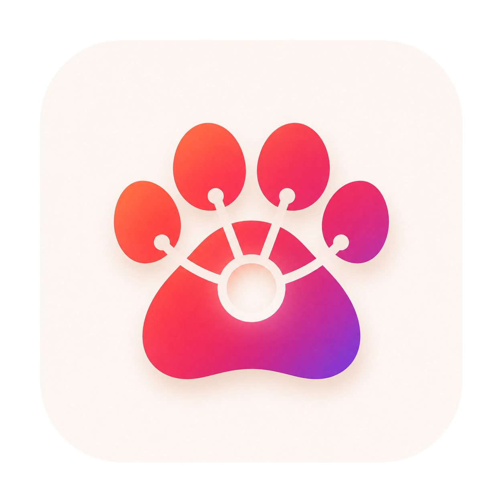

<div align="center">
  <a href="https://discoverivan.github.io/mework/#downloads">
    
  </a>
  <h1>mework</h1>
  <p><strong>A local-first desktop workspace for Jira, pull requests, and AI-assisted delivery.</strong></p>
  <p>
    <a href="https://discoverivan.github.io/mework/#downloads"><strong>Download latest</strong></a>
    &nbsp;·&nbsp;
    <a href="https://github.com/Discoverivan/mework/releases/latest">Release notes</a>
    &nbsp;·&nbsp;
    <a href="https://github.com/Discoverivan/mework/actions">Build status</a>
  </p>
  <p>
    <a href="https://discoverivan.github.io/mework/#downloads">macOS · Apple Silicon</a>
    &nbsp;·&nbsp;
    <a href="https://discoverivan.github.io/mework/#downloads">macOS · Intel</a>
    &nbsp;·&nbsp;
    <a href="https://discoverivan.github.io/mework/#downloads">Windows</a>
  </p>
  <p>
    
    <a href="https://github.com/Discoverivan/mework/actions/workflows/ci.yml?query=branch%3Amaster"></a>
    <a href="https://github.com/Discoverivan/mework/actions/workflows/release.yml?query=branch%3Amaster"></a>
  </p>
</div>

## Download

The [download page](https://discoverivan.github.io/mework/#downloads) reads the latest published GitHub release at runtime, so its platform links stay current without changing this README.

| Platform | Latest download |
| --- | --- |
| macOS · Apple Silicon | [Open latest download](https://discoverivan.github.io/mework/#downloads) |
| macOS · Intel | [Open latest download](https://discoverivan.github.io/mework/#downloads) |
| Windows · Installer | [Open latest download](https://discoverivan.github.io/mework/#downloads) |
| Windows · MSI | [Open latest download](https://discoverivan.github.io/mework/#downloads) |
| Updater metadata | [`latest.json`](https://github.com/Discoverivan/mework/releases/latest/download/latest.json) |
| All release assets | [Open latest GitHub release](https://github.com/Discoverivan/mework/releases/latest) |

> **macOS note:** the application is ad-hoc signed and not notarized. On first launch, macOS may require **System Settings → Privacy & Security → Open Anyway**.

## What it does

mework keeps day-to-day engineering work in one local desktop workspace:

- **Create task** — describe work in natural language, generate an editable AI draft, choose `Task` or `Spike`, review Jira fields, and create the issue only after an explicit action.
- **Sprint tasks** — choose a Jira sprint, inspect all work by assignee, refresh status, and open a second-window presenter view for stand-ups.
- **Pull requests awaiting your review** — poll Bitbucket pull requests, track new or updated activity, run an AI review, inspect severity-grouped comments, and publish an edited comment or decision from the review flow.
- **Pull requests authored by you** — follow authored pull requests, surface items that need attention, and optionally run automatic AI review for configured activity.
- **Command Board** — keep local scripts and commands close at hand and run them from a small, editable command board.
- **Settings** — manage Jira and Bitbucket connections, AI providers, managed teams, notifications, themes, and application updates.

## How it works

- **Tauri 2 shell** with a React, TypeScript, and Vite renderer.
- **Rust local core** owns polling, SQLite state, provider requests, AI adapters, credentials, notifications, workflows, and recovery.
- **Jira and Bitbucket** are read through polling; the background refresh interval is five minutes. Webhooks are intentionally out of scope.
- **Remote writes require an explicit user action** and are handled by the Rust core rather than the renderer or an AI agent.
- **AI providers:** local Codex CLI, local Claude Code CLI, or an OpenAI-compatible API. Claude Code uses its existing login and supports the `sonnet`, `opus`, and `haiku` model aliases. OpenAI-compatible models are discovered from `GET <base URL>/models`; static model metadata is not used.
- **Windows Codex CLI:** mework checks `PATH` for `codex.exe`/`codex.cmd` and the standalone installer location `%LOCALAPPDATA%\Programs\OpenAI\Codex\bin\codex.exe`; Codex keeps its own authentication and configuration under `%USERPROFILE%\.codex`.
- **CLI discovery:** all local AI CLIs use the same order: `MEWORK_*_BIN`, inherited `PATH`, common user/system and installer-specific locations, then fnm installations as a last resort (newest Node version first within each fnm root). The selected CLI directory is added to its process PATH; on macOS/Linux, standard Homebrew directories are also included for npm entrypoints that need Node. Diagnostics use the same candidates as executable resolution.
- **Pi CLI:** install the terminal CLI using the [Pi quickstart](https://pi.dev/docs/latest/quickstart), sign in with `/login`, and refresh AI Settings. A desktop UI alone does not supply the CLI. mework checks `PATH` and common user installations, including `%LOCALAPPDATA%\Programs\Pi\pi.exe`, the user npm directory on Windows, and `~/.local/bin/pi` or Homebrew on macOS. For a custom installation, set `MEWORK_PI_BIN` to the absolute CLI path. An installed CLI without available models is reported as not configured.
- **Themes:** white/light and dark, with the initial choice following the operating-system preference.

## Privacy and credentials

- Jira, Bitbucket, and OpenAI-compatible API credentials are stored only in the native operating-system keyring.
- SQLite stores local application state and credential references, not token values.
- Credentials, authorization headers, and full prompts are not returned to the renderer or written to logs.
- OpenAI-compatible external URLs must use HTTPS; HTTP is reserved for localhost. `allow_insecure_tls` is an explicit opt-in for trusted environments and should not be enabled for untrusted endpoints.
- Development (`mework-dev`) and release (`mework`) use separate application data and keyring namespaces.

General Settings controls retention independently for PR review history, sync history, removed tasks, and diagnostic logs. Each type supports a positive retention period (7 days by default), indefinite retention, or disabled history. Disabling history immediately removes eligible historical records and avoids retaining new completed sync history or removed task snapshots; current tasks, reviews for current PRs, active runs, durable checkpoints, and AI usage totals remain available. Review history is also pruned after PR cache refreshes and review completion. Existing zero-valued settings retain their previous indefinite meaning when loaded; no SQLite migration is needed.

Troubleshooting opens the local `logs` directory. The Rust core writes JSON lines directly to `application.YYYY-MM-DD.NNN.log`, including the current file. Dates follow the operating system's local timezone (UTC if the system offset is unavailable). A new local day starts at part `001`; a write that would exceed 5 MiB (or the configured total limit if smaller) starts the next part. After restarting, logging continues the latest part for the current day if it still has room. Diagnostic logs have an independent total size limit in KiB, MiB, or GiB (100 MiB by default), which can be removed separately from the age limit. Cleanup runs at startup, daily, and when settings are saved. Dated files expire by the date in their name; last-write time refines expiration on the cutoff day for shorter retention periods. The total size limit includes the current part and removes the oldest dated parts as needed. Legacy `application.log` and `application.log.1` files are retained without renaming and expire by their last-write time. Disabling diagnostic log storage stops writing and deletes accumulated application log files, including empty parts. Other files, directories, and symlinks in the logs directory are left untouched.

## Development

### Prerequisites

- Node.js `>=24.15.0 <25` and npm
- Rust stable and the native toolchain required by Tauri 2
- The repository-pinned Node version from [`.nvmrc`](.nvmrc)

### Checks

```bash
npm ci
npm test -- --run
npm run lint
npm run build
cargo fmt --check --manifest-path src-tauri/Cargo.toml
cargo test --manifest-path src-tauri/Cargo.toml
cargo check --release --manifest-path src-tauri/Cargo.toml
```

These checks do not launch the desktop application. Launch the UI only for an intentional, specific verification:

```bash
npm run tauri:dev
```

The development launcher uses `src-tauri/tauri.dev.conf.json`, the `mework-dev` identity, a separate SQLite database, and a separate OS keyring namespace. Configure integrations through **Settings → Integrations**; never put credentials in `.env` files, source code, SQLite, or test fixtures.

To run the local mock scenario with synthetic Jira, Bitbucket, and Confluence data (AI may still use the configured provider), opt in explicitly:

```bash
npm run tauri:dev -- --mock
```

Mock mode is debug-build-only. Each launch deletes only the dedicated `mework-mock.sqlite` database and its SQLite sidecars, creates a fresh database, applies all migrations, and seeds synthetic Jira/Bitbucket/Confluence integrations, a planning project/team, and sample Task Tracker issues. It does not open, migrate, read, or copy settings from the regular DEV database; that database and the release application's database are left untouched. Mock integration URLs point to loopback REST stubs, and their credentials are synthetic. Codex CLI and Claude Code CLI are registered and checked for local availability/authentication; if both are connected, Codex is selected. No AI generation runs at startup. The fresh mock database does not inherit OpenAI-compatible provider configuration; if configured in mock mode, its token is stored in the development OS keyring, never in SQLite. Provider integration requests stay on the loopback stubs, while real AI calls require an explicit user action. The overlay can add synthetic Jira tasks and PRs and change task status. Running `npm run tauri:dev` without `--mock` retains the normal integration behavior.

Mock mode also opens synthetic release notes at startup. Close the window, then reopen it from **About → Release notes**. The preview uses sample versions and does not mark any real release notes as seen.

See [`AGENTS.md`](AGENTS.md) for repository boundaries and safety rules. Architecture decisions live in [`docs/adr/`](docs/adr/).

## GitHub Pages

The static download landing page is [`docs/index.html`](docs/index.html). [`Deploy GitHub Pages`](.github/workflows/pages.yml) publishes the `docs/` directory from `master` and exposes it at:

**https://discoverivan.github.io/mework/**

The page reads the public GitHub Releases API at runtime and falls back to the latest GitHub release page if the API is unavailable. It contains no credentials, requires no build step, and does not require version-specific edits when a new release is published.

To enable it in a repository that has not used Pages before, select **Settings → Pages → Source: GitHub Actions** once; subsequent updates deploy from the workflow.

## License

No license has been published yet.
